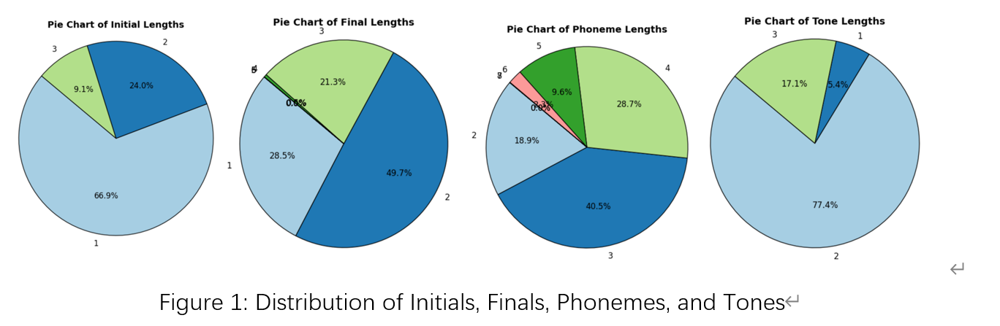
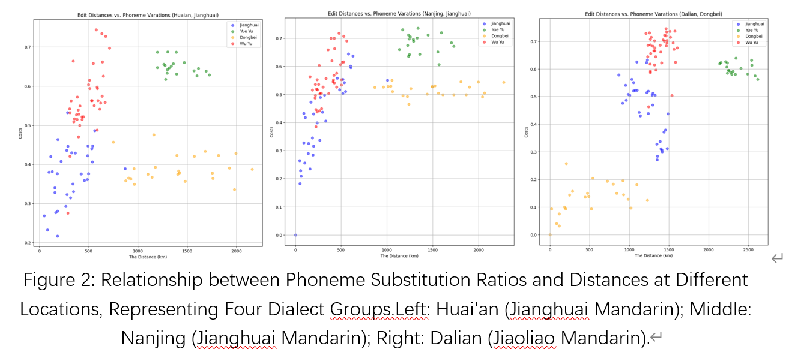
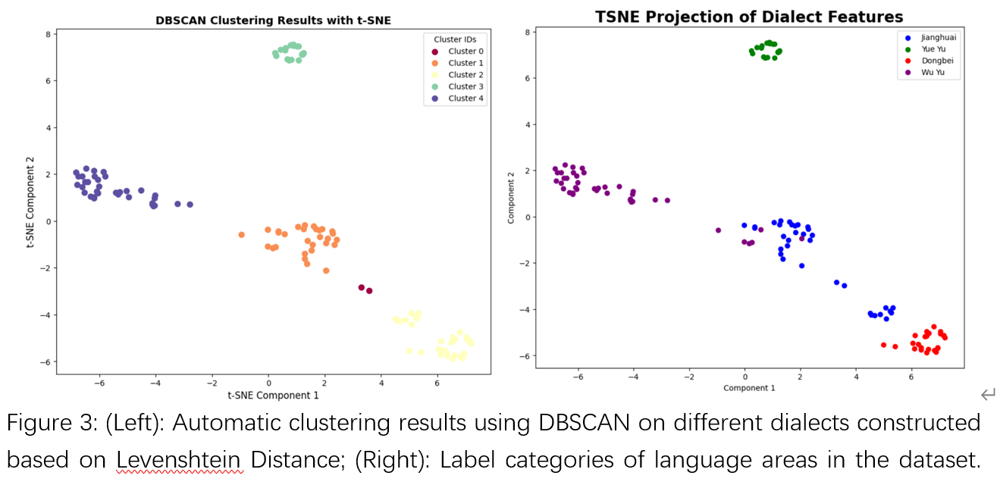
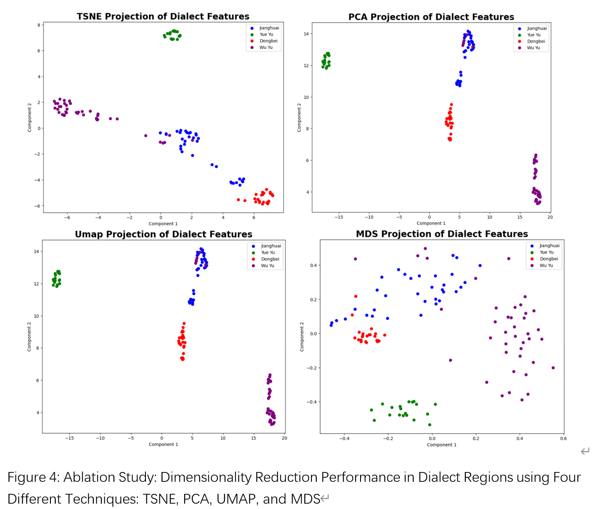
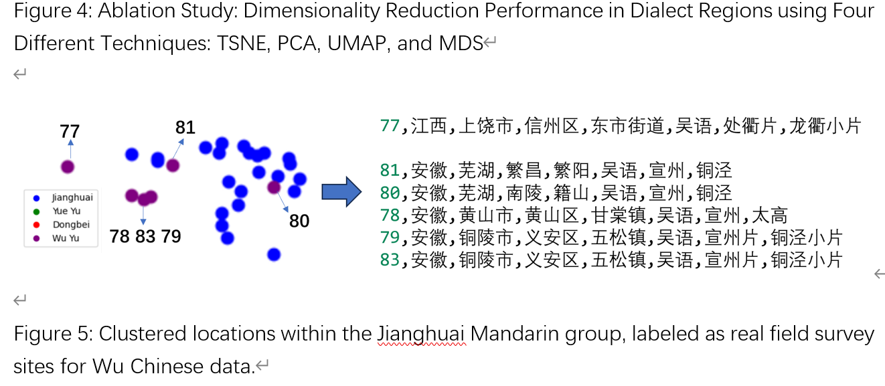
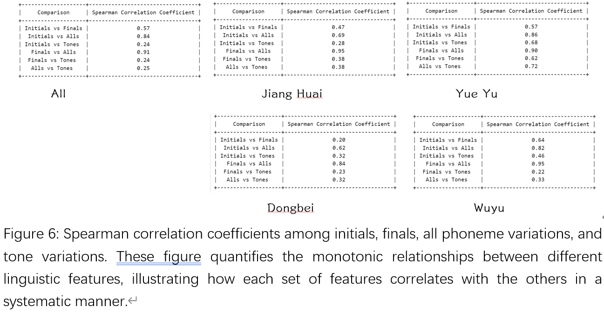
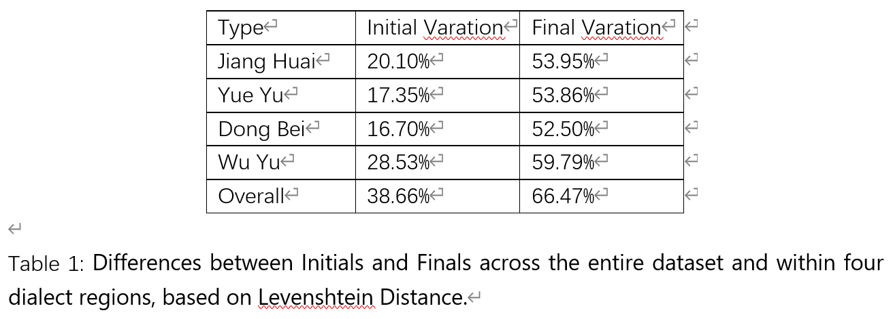

# Quantifying Language Evolution with Transcriptions Only

## Official Code Repository

This repository contains the official code for the paper titled "Quantifying Language Evolution with Transcriptions Only," presented at the International Conference in Evolutionary Linguistics (CIEL).

### Features

The code package offers several advanced functionalities designed to support research in evolutionary linguistics:

- **Improved Levenshtein Distance**: Adaptable to any transition matrix input.
- **Transcription Parsing**: Converts raw transcriptions into a formal format suitable for analysis.
- **Automatic Dialect Clustering**: Facilitates dialect clustering using only transcription data.

### Key Findings

Our research has led to several significant insights into the evolution of language:

1. **Quantitative Capture of Dialect Variations**: As shown in Figure 2, the Levenshtein Distance effectively quantifies the variations among different dialects. Dialects within the same category tend to be more similar to each other compared to those from different categories.

2. **Language Diffusion Analysis**: Figure 2 also demonstrates that the phoneme substitution ratio maintains a linear relationship with geographical distance up to 500 km, across both same and different dialect categories. This observation suggests a gradual trend in language evolution. However, beyond 1000 km, the differences between dialect areas become pronounced and lack consistent patterns.

3. **Automatic Dialect Categorization**: Utilizing similarity features based on Levenshtein Distance, we introduced an automatic dialect categorization method using DBSCAN. As depicted in Figure 3, our approach aligns closely with the labeled categories of each language. Additionally, Figure 4 highlights an ablation study confirming the robustness of these features, demonstrating effective clustering across four distinct dimensionality reduction techniques.

4. **Refinement of Manual Labels**: Surprisingly, as illustrated in Figure 5, our model correctly grouped some Wu Chinese dialect points into the Jianghuai Mandarin category, initially thought to be an error. Further investigation into the corresponding dialect locations revealed labeling inaccuracies, confirming our model's effectiveness given the actual geographical distances.

5. **Evolution Speed and Correlation Analysis**: In Figures 6 and Table 1, we explore the evolution speed of initials and finals. We also examine the correlations between the evolution of tones and other phonetic changes including initials and finals.

